# Portfolio of Stanislav Akhmadeev

- Portfolio: https://github.com/krikun1983/Portfolio#readme
- Codewars: https://www.codewars.com/users/krikun1983

## Многофункциональный TODO-лист с неограниченной вложенностью категорий и фильтрацией прикрепленных задач и страницей авторизации + CRUD API на Node JS ##

<table border="0">
<tr>
    <td>
        <ul>
            <li><b>Деплой проекта:</b> <https://krikun1983-react-redux-ts-node-express.netlify.app> (Логин: Stanislav, пароль: 12345)</li>
            <li><b>Ссылка на репозиторий:</b> <https://github.com/krikun1983/todo-react-redux-thunk-ts-node-express-mongobd-js/></>
            <li><b>Стек технологий:</b> React, Redux (Redux-Thunk), React-router 6, Typescript, Node js,  Express, MongoDB, Rest API, ESLint, Prettier</li>
            <li><b>Описание:</b> Многофункциональный TODO-лист с неограниченной вложенностью категорий и фильтрацией прикрепленных задач + CRUD API (Node JS). Присутствует страница авторизации. Категории можно редактировать, удалять, добавлять, вкладывать в другие категории. Задачи можно создавать, переносить в другие категории, выполнять, переименовывать, добавлять описание. Также присутствует шкала выполнения задач категории и фильтр поиска.</li>
    </td>
    <td width="40%">
        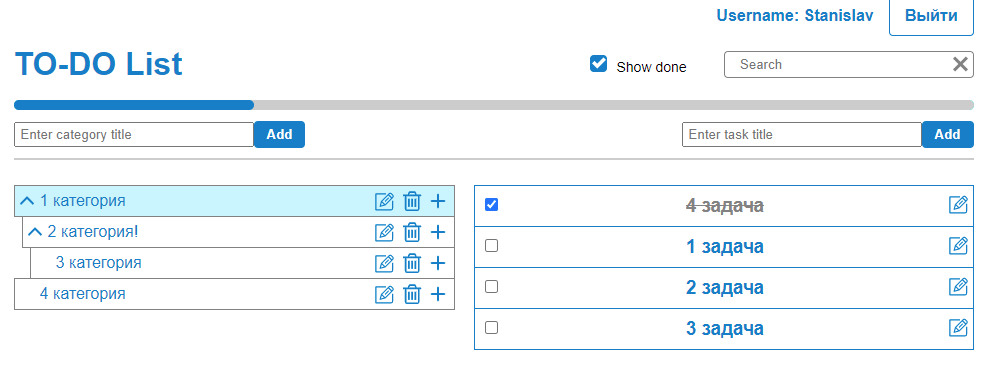
    </td>
</tr>
</table>

## Браузерная игра

<table border="0">
<tr>
    <td>
        <ul>
            <li><b>Деплой проекта:</b> https://space-battle-krikun1983.netlify.app/ </li>
            <li><b>Ссылка на репозиторий:</b> https://github.com/krikun1983/space-battle-canvas-js</>
            <li><b>Стек технологий:</b> JS, Canvas API, RequestAnimationFrame </li>
            <li><b>Описание приложения:</b> Браузерная игра на ванильном JavaScript и HTML5 (Canvas + window.requestAnimationFrame). Космический корабль пробирается между астероидами и вражескими кораблями. Клавиатурное управление. Есть возможность убивать врага и астероиды, получая за это очки и бонусы. Есть выбор сложности игры и запись имени игрока. Игрок, набравший наибольшее количество очков, записывается в рекордсмены.</li>
    </td>
    <td width="40%">
        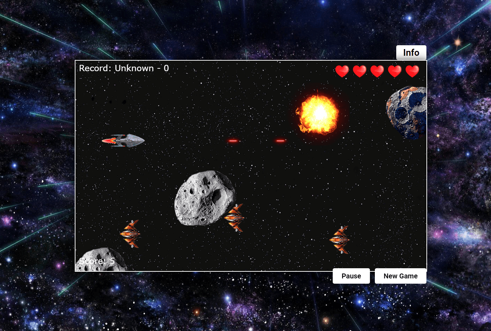
    </td>
</tr>
</table>

## Приложение «Звездные войны»

<table border="0">
<tr>
    <td>
        <ul>
            <li><b>Деплой проекта:</b> https://krikun1983-react-star-wars-api-typescript.netlify.app/ </li>
            <li><b>Ссылка на репозиторий:</b> https://github.com/krikun1983/react-star-wars-api-ts</>
            <li><b>Стек технологий:</b> React, Redux, SPA (React-router 5), TypeScript, Webpack, Own Hooks, UI-kit, React Context Api</li>
            <li><b>Описание приложения:</b> Можно просматривать информацию о персонаже саги. Добавлять в избранное, искать по имени. Менять цветовую тему.</li>
    </td>
    <td width="40%">
        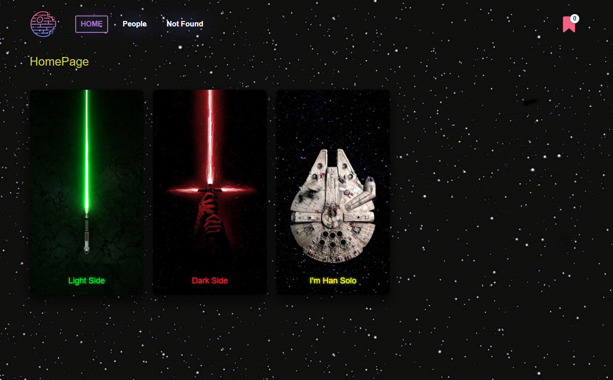
    </td>
</tr>
</table>

## Приложение английский для детей

<table border="0">
<tr>
    <td>
        <ul>
            <li>Деплой проекта: https://krikun1983-english-for-kids-base.netlify.app/ </li>
            <li>Ссылка на репозиторий: https://github.com/krikun1983/english-for-kids-base</>
            <li>Стек технологий: Javascript(ES6+), TypeScript, React, Redux, SPA, Webpack, Browser API</li>
            <li>Описание приложения: Приложение для изучения английских слов детьми. Приложение работает в режиме тренировки и в режиме игры. Имеется возможность посмотреть статистику, работа над ошибками.</li>
    </td>
    <td width="40%">
        
    </td>
</tr>
</table>

## Приложение The Rick and Morty

<table border="0">
<tr>
    <td>
        <ul>
            <li>Деплой проекта: https://krikun-react-redux.netlify.app/ </li>
            <li>Ссылка на репозиторий: https://github.com/krikun1983/react-redux-api-router</>
            <li>Ссылка на API: https://rickandmortyapi.com/about</>
            <li>Стек технологий: TypeScript, Spa, React, Redux, Router, Api, Webpack </li>
            <li>Описание приложения: Работа с учебным API - The Rick and Morty API is a REST</li>
    </td>
    <td width="40%">
        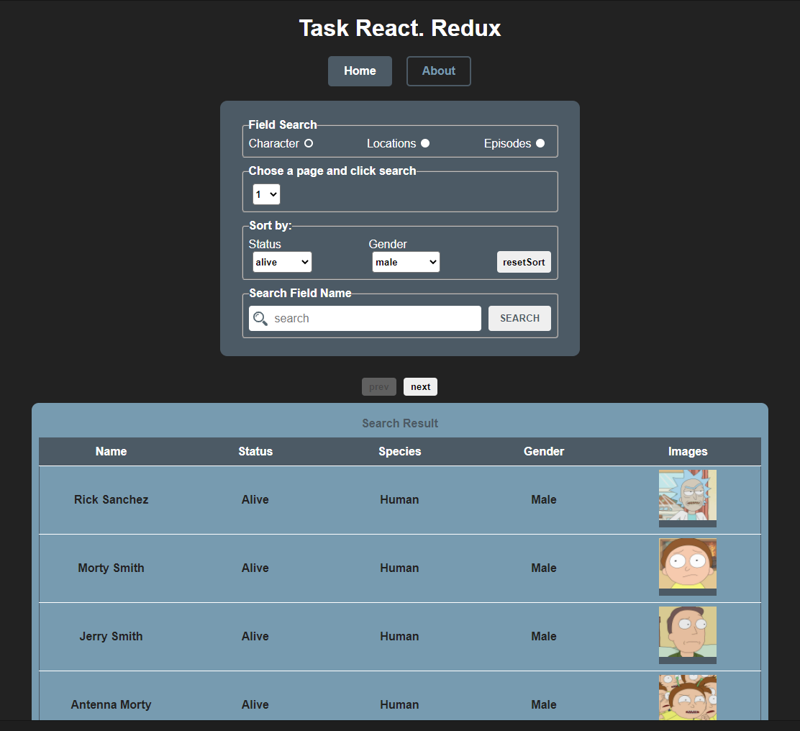
    </td>
</tr>
</table>

## SPA приложение: асинхронные гонки

<table border="0">
<tr>
    <td>
        <ul>
            <li>Ссылка на сервер: https://github.com/mikhama/async-race-api</li>
            <li>Деплой проекта: (Внимание, не работает без запущенного сервера): https://krikun1983-async-race.netlify.app </li>
            <li>Ссылка на репозиторий: https://github.com/krikun1983/async-race </li>
            <li>Стек технологий: TypeScript, SPA, Webpack, Сommunication with a server (fetch, REST API), Async coding / Promises, JS Animations, DOM Api </li>
            <li>Описание приложения: Машинки на скорость, в зависимости от ответа сервера, передвигаются по игровому полю, как одиночно, так и в общем заезде. Можно создавать машинки и менять их цвет и имя, а также удалять. Также реализовано рендомное создание машинок. Победитель попадает в таблицу лидеров. Таблица имеет возможность сортировки и удаления машинок. Если количество машин больше 7, то реализована постраничная пагинация. </li>
    </td>
    <td width="40%">
        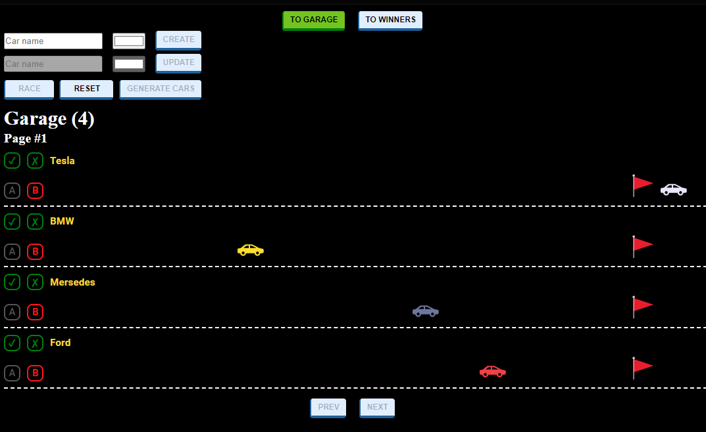
    </td>
</tr>
</table>

## Игра Матч-матч

<table border="0">
<tr>
    <td>
        <ul>
            <li>Деплой проекта: https://krikun1983-match-match-game.netlify.app/#/ </li>
            <li>Ссылка на репозиторий: https://github.com/krikun1983/match-match-game </li>
            <li>Стек технологий: TypeScript, SPA,IndexedDb, Webpack </li>
            <li>Описание приложения: Игра match-match используется для тренировки памяти. Игровое поле состоит из карточек с разными рисунками на обратной стороне. Перед началом игровой сессии игроку показывают расположение всех парных карточек, по истечению 30 секунд их скрывают. Победа засчитывается когда найдены все пары карточек.</li>
    </td>
    <td width="40%">
        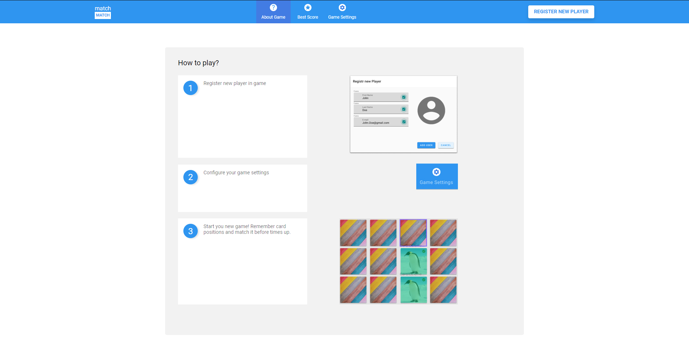
    </td>
</tr>
</table>

## Фото Фильтр

<table border="0">
<tr>
    <td>
        <ul>
            <li>Деплой проекта: https://rolling-scopes-school.github.io/krikun1983-JSFE2021Q1/photo-filter/</li>
            <li>Ссылка на репозиторий: https://github.com/krikun1983/photo-filter </li>
            <li>Стек технологий: Работа с файлами, загрузка локальных файлов в приложение, сохранение файла на компьютер, работа с Date API, Canvas API</li>
            <li>Описание приложения: Photo-filter, в зависимости от времени суток (утро, день, вечер, ночь) подгружаются разный пакеты фотографий. Есть возможность загрузить свою фотографию с компьютера, а так же скачать с выбранными фильтрами.</li>
    </td>
    <td width="40%">
        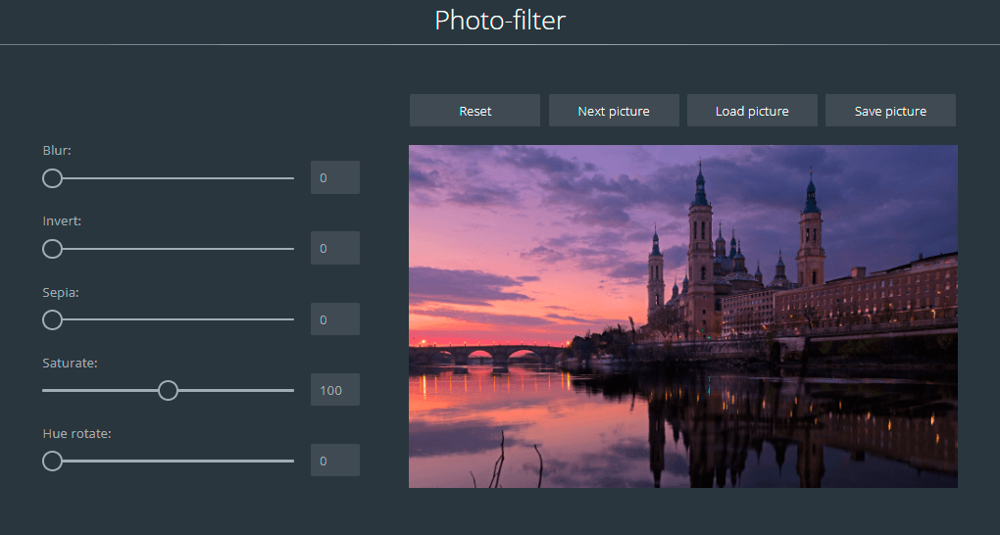
    </td>
</tr>
</table>

## Адаптивный сайт на ванильном JS, SCSS и HTML

<table border="0">
<tr>
    <td>
        <ul>
            <li>Деплой проекта: https://rolling-scopes-school.github.io/krikun1983-JSFE2021Q1/online-zoo/</li>
            <li>Ссылка на репозиторий: https://github.com/krikun1983/online-zoo</li>
            <li>Описание приложения: layout for desktop skrins, adaptive for 1920px, 1200px, js</li>
            <li>Описание приложения: Адаптивный сайт на ванильном JS, SCSS и HTML, адаптированный под разные экраны</li>
    </td>
    <td width="40%">
        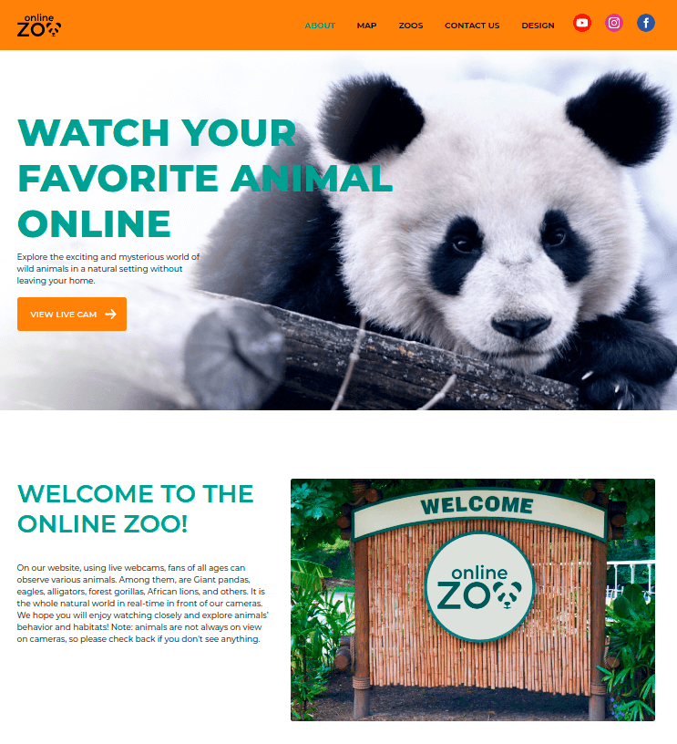
    </td>
</tr>
</table>

## Игра крестики нолики

<table border="0">
<tr>
    <td>
        <ul>
            <li>Деплой проекта: https://krikun1983-tic-tac-toe-game.netlify.app/ </li>
            <li>Ссылка на репозиторий: https://github.com/krikun1983/tic-tac-toe-game </li>
            <li>Стек технологий: TypeScript, React, Sass, Webpack</li>
            <li>Описание приложения: Простая игра крестики нолики с возможностью отмены шагов</li>
    </td>
    <td width="40%">
        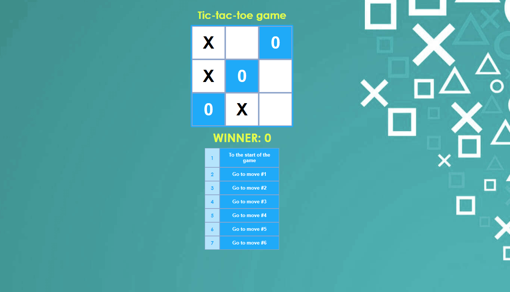
    </td>
</tr>
</table>

## Virtual-piano

<table border="0">
<tr>
    <td>
        <ul>
            <li>Деплой проекта: https://rolling-scopes-school.github.io/krikun1983-JSFE2021Q1/virtual-piano/</li>
            <li>Ссылка на репозиторий: https://github.com/krikun1983/virtual-piano </li>
            <li>Стек технологий: Работа с DOM, работа со звуком, mouse events, keyboard events</li>
    </td>
    <td width="40%">
        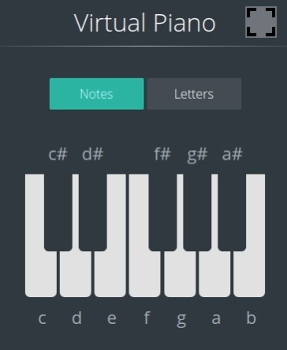
    </td>
</tr>
</table>

## Саратовскийисточник.рф

<table border="0">
<tr>
    <td>
        <ul>
            <li>Деплой проекта: http://xn--80aagyaafge2affsmfeji0h.xn--p1ai/</li>
            <li>Стек технологий: Joomla, HTML, CSS</li>
            <li>Описание проекта: Новостной портал на CMS, адаптированный под разные экраны</li>
    </td>
    <td width="40%">
        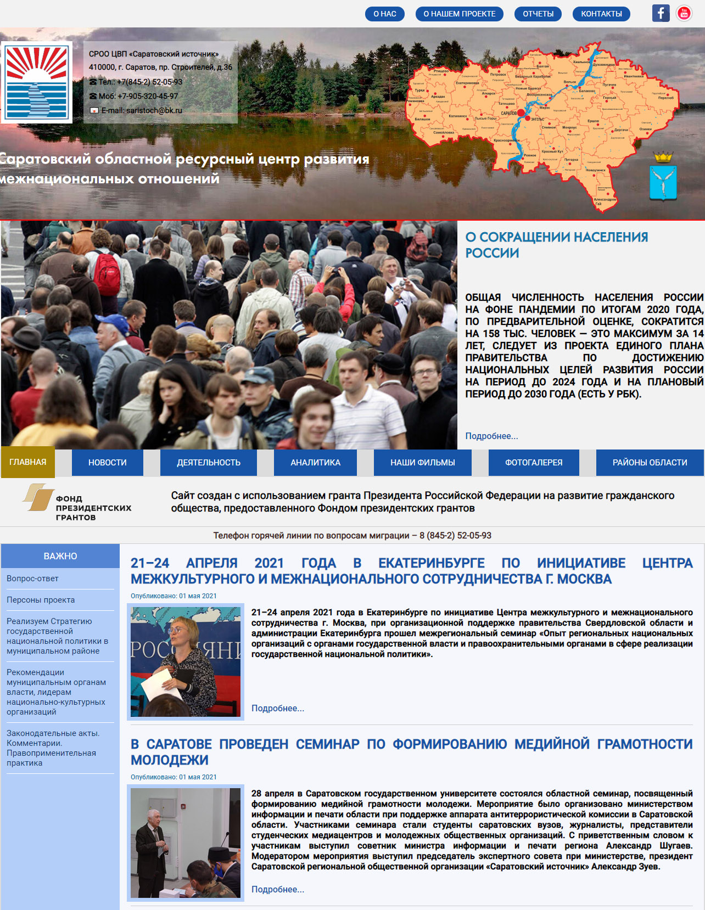
    </td>
</tr>
</table>
