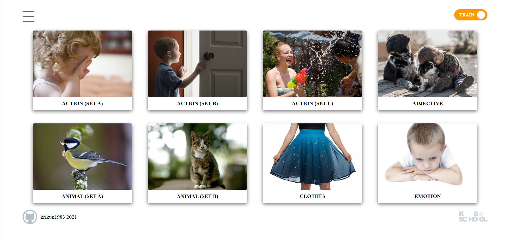

# Portfolio of Stanislav Akhmadeev

- Portfolio: https://github.com/krikun1983/Portfolio#readme
- Codewars: https://www.codewars.com/users/krikun1983

## English for kids 

<table border="0">
<tr>
    <td>
        <ul>
            <li>Task: https://github.com/rolling-scopes-school/tasks/blob/master/tasks/rslang/english-for-kids.md </li>
            <li>Work: https://krikun1983-english-for-kids-base.netlify.app/ </li>
            <li>Link to repo: https://github.com/krikun1983/english-for-kids-base</>
            <li>Key skills: TypeScript, Spa, React, Redux, Webpack </li>
            <li>20.07.2021</li>
    </td>
    <td width="40%">
        
    </td>
</tr>
</table>

## Match-Match Game

<table border="0">
<tr>
    <td>
        <ul>
            <li>Task: https://github.com/rolling-scopes-school/tasks/blob/master/tasks/match-match-game.md</li>
            <li>Work: https://krikun1983-match-match-game.netlify.app/#/ </li>
            <li>Link to repo: https://github.com/krikun1983/match-match-game </li>
            <li>Key skills: TypeScript, SPA,IndexedDb, Webpack </li>
            <li>30.05.2021</li>
    </td>
    <td width="40%">
        
    </td>
</tr>
</table>

## The tic-tac-toe game

<table border="0">
<tr>
    <td>
        <ul>
            <li>Work: https://krikun1983-tic-tac-toe-game.netlify.app/ </li>
            <li>Link to repo: https://github.com/krikun1983/tic-tac-toe-game </li>
            <li>Key skills: TypeScript, React, Sass, Webpack </li>
            <li>27.07.2021</li>
    </td>
    <td width="40%">
        
    </td>
</tr>
</table>

## Photo-filter

<table border="0">
<tr>
    <td>
        <ul>
            <li>Task: https://rolling-scopes-school.github.io/stage0/#/stage1/tasks/js-projects/photo-filter</li>
            <li>Work: https://rolling-scopes-school.github.io/krikun1983-JSFE2021Q1/photo-filter/</li>
            <li>Link to repo: https://github.com/krikun1983/photo-filter </li>
            <li>Key skills: work with files, upload local files, save files to computer, work with Date, Canvas API</li>
            <li>26.04.2021</li>
    </td>
    <td width="40%">
        
    </td>
</tr>
</table>

## Online-zoo - animal observation site

<table border="0">
<tr>
    <td>
        <ul>
            <li>Task: https://rolling-scopes-school.github.io/stage0/#/stage1/tasks/online-zoo/variant-2</li>
            <li>Work: https://rolling-scopes-school.github.io/krikun1983-JSFE2021Q1/online-zoo/</li>
            <li>Link to repo: https://github.com/krikun1983/online-zoo</li>
            <li>Key skills: layout for desktop skrins, adaptive for 1920px, 1200px, js</li>
            <li>07.05.2021</li>
    </td>
    <td width="40%">
        
    </td>
</tr>
</table>

## Virtual-piano

<table border="0">
<tr>
    <td>
        <ul>
            <li>Task: https://rolling-scopes-school.github.io/stage0/#/stage1/tasks/js-projects/virtual-piano</li>
            <li>Work: https://rolling-scopes-school.github.io/krikun1983-JSFE2021Q1/virtual-piano/</li>
            <li>Link to repo: https://github.com/krikun1983/virtual-piano </li>
            <li>Key skills: work with DOM, work with sound, work with Fullscreen API, mouse events, keyboard events</li>
            <li>17.03.2021</li>
    </td>
    <td width="40%">
        
    </td>
</tr>
</table>

## Саратовскийисточник.рф

<table border="0">
<tr>
    <td>
        <ul>
            <li>Work: http://xn--80aagyaafge2affsmfeji0h.xn--p1ai/</li>
            <li>Key skills: Joomla, HTML, CSS</li>
            <li>1.11.2020</li>
    </td>
    <td width="40%">
        
    </td>
</tr>
</table>

## Virtual keyboard

<table border="0">
<tr>
    <td>
        <ul>
            <li>Task: https://github.com/rolling-scopes-school/tasks/blob/master/tasks/codejam-virtual-keyboard.md</li>
            <li>Work: https://krikun1983.github.io/codejam-virtual-keyboard/</li>
            <li>Key skills: JS mouse events, JS keyboard events</li>
            <li>1.11.2020</li>
    </td>
    <td width="40%">
        
    </td>
</tr>
</table>
